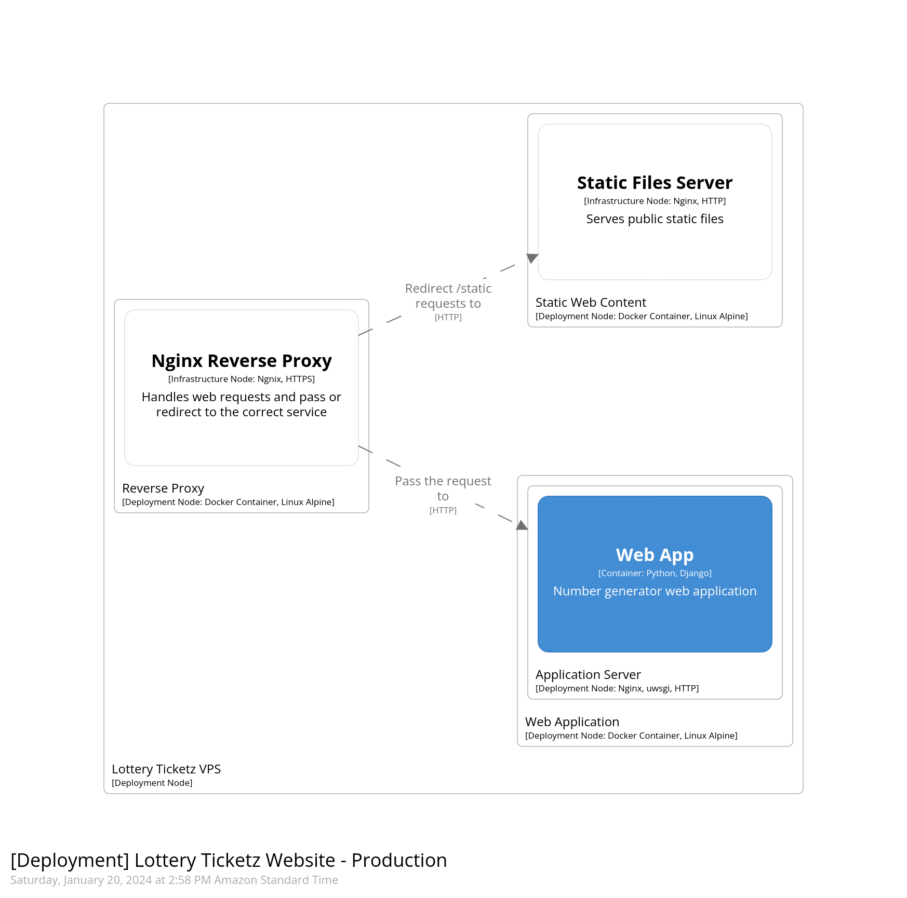

# Lottery Numberz - C4 Model

The following diagrams was generated by Structurizr Lite using its DSL, the actual code can be found at [workspace.dsl](../workspace.json) file.

## Software Context

## Web App Container

## Deployment 

